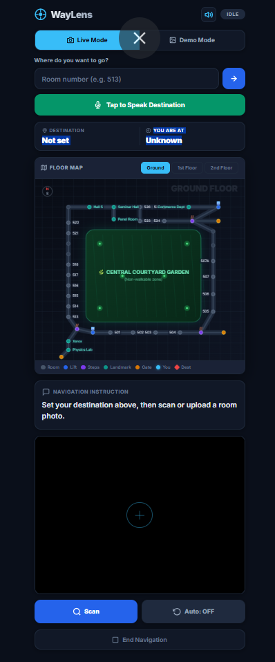
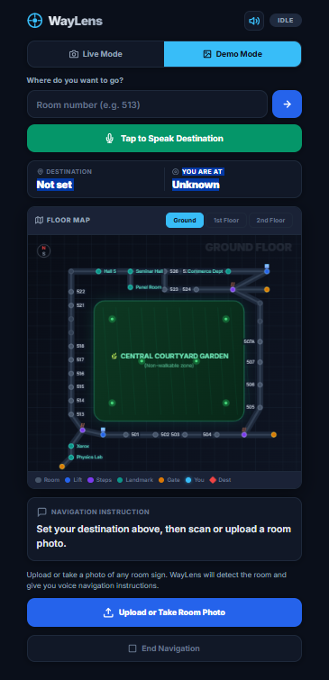
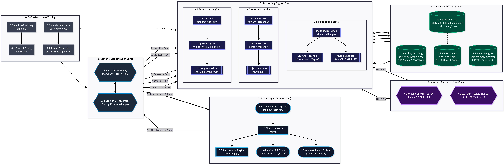
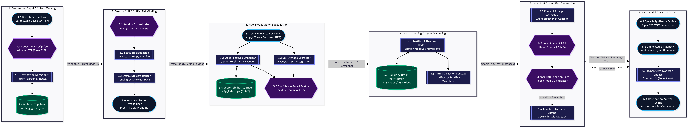

# WayLens: University Indoor Navigation Assistant

WayLens is an autonomous on-device artificial intelligence navigation assistant developed for university campus classroom buildings. The system enables visually impaired students, faculty, and campus visitors to independently navigate complex multi-floor academic structures. By integrating local vision perception, spatial graph topology, local language models, and local diffusion image generation, WayLens delivers real-time auditory instructions and interactive visual navigation without relying on any external cloud services or proprietary APIs.

[Watch Video Demonstration (demo.mp4)](demo/demo.mp4) | [View Architecture Plan](docs/architecture_plan.md) | [Problem Statement](docs/WayLens_Problem_statement.pdf)

---

## Overview

WayLens provides an accessible, high-contrast user interface tailored for fast camera scanning, voice interaction, and real-time 2D floor map tracking.

| Live Camera Navigation Mode | Demo Photo Upload Mode |
|:---:|:---:|
|  |  |
| *Continuous camera scanning with live HUD crosshair, voice toggle, and real-time step progress* | *Single photo inspection with instant OCR room detection and spoken guidance* |

---

## 1. Problem Statement and University Focus

University campuses present severe spatial navigation challenges for visually impaired and low-vision individuals:
- Highly uniform corridors across multiple floors with minimal tactile distinctions.
- Missing GPS signals inside concrete and steel academic blocks.
- Frequent room numbering transitions across wings, departments, and level splits.
- Lack of continuous, step-by-step guidance tailored to human orientation.

WayLens solves this problem by turning a smartphone into an autonomous spatial guidance assistant. The system processes live camera scans, resolves location against a verified university building topology, determines optimal corridor paths via deterministic routing, generates natural spoken instructions using a local large language model, and synthesizes corridor and landmark visual representations using a local image generation model.

---

## 2. System Architecture and Implementation Mapping

The application operates entirely on local hardware (CPU and local GPU), strictly avoiding any cloud APIs (OpenAI, Google Gemini, Anthropic Claude, Azure, AWS).



| Requirement | Implementation Component | File Location | Technology Stack |
|---|---|---|---|
| **Local LLM** | Structured Instruction Generator | `src/llm_instructor.py` | Llama 3.2 3B Instruct via local Ollama |
| **Local Image Generation** | Synthetic Augmentation and Landmark Visualizer | `src/sd_augmentation.py` | Stable Diffusion 1.5 via local AUTOMATIC1111 |
| **Unified Workflow** | Single End-to-End Navigation Pipeline | `src/server.py`, `src/navigation_session.py` | FastAPI, Python Async Session Orchestrator |
| **Zero Cloud APIs** | 100% On-Device Perception and Inference | All modules in `src/` | PyTorch CPU, OpenCLIP, EasyOCR, Whisper |
| **Visual Perception** | Multimodal OCR and CLIP Embedding Fusion | `src/localization.py`, `src/embedding_index.py` | EasyOCR + open_clip (ViT-B-32) |
| **Spatial Graph** | 3-Floor Knowledge Graph (116 Nodes) | `src/building_graph.py`, `data/building_graph.json` | NetworkX Directional Topological Graph |
| **Deterministic Routing**| Shortest Corridor Path Computation | `src/routing.py`, `src/state_tracker.py` | Dijkstra Algorithm + Cardinal Heading Translation |
| **Speech Interface** | Local Speech-to-Text and Text-to-Speech | `src/speech_io.py` | faster-whisper (int8 CPU) + Piper / pyttsx3 |
| **Interactive Map** | High-DPI Real-Time 2D Virtual Map | `static/floormap.js`, `static/app.js` | HTML5 Canvas + Radar Sweep Pointer |

---

## 3. End-to-End Working Workflow



WayLens executes text generation, image generation, visual perception, and spatial reasoning within a single unified workflow:

1. **Destination Parsing (Input)**:
   - The user speaks or types a destination (e.g., "Take me to Room 513" or "Department of Mathematics").
   - `src/intent_parser.py` parses spoken variations, normalizes numbers, matches department aliases, and validates against the building graph.

2. **Perception and Localization**:
   - The user points their smartphone camera at nearby door signs or corridor surroundings.
   - `src/localization.py` executes lightweight EasyOCR to extract room numbers and department plaques.
   - Concurrently, `src/embedding_index.py` computes a 512-dimensional CLIP embedding of the camera frame and performs cosine similarity matching against the building dataset.
   - OCR and CLIP predictions are fused: when both agree, confidence reaches maximum certainty; when signs are occluded, CLIP visual similarity provides spatial anchoring.

3. **State Tracking and Deterministic Routing**:
   - `src/state_tracker.py` tracks position history, infers heading (north, south, east, west), and detects backtracking or incorrect turns.
   - `src/routing.py` executes Dijkstra shortest-path search over the building graph (`src/building_graph.py`), routing through walkable corridors and guiding users to lifts or stairs for floor changes (Ground: 500 series, First Floor: 600 series, Second Floor: 700 series). Non-walkable areas such as the central garden courtyard are strictly excluded.

4. **Local Text Generation (Ollama Llama 3.2 3B)**:
   - Structured facts (current location, next landmark, turn direction relative to user orientation, remaining steps) are passed to the local LLM in `src/llm_instructor.py`.
   - Llama 3.2 generates a concise, natural spoken sentence under 18 words without hallucinating non-existent rooms.

5. **Local Image Generation (Stable Diffusion 1.5)**:
   - In `src/sd_augmentation.py` and `src/server.py` (`/api/generate-visual`), Stable Diffusion 1.5 generates synthetic variations of corridor perspectives, lighting shifts, and visual landmark previews.
   - These generated images serve dual purposes: offline augmentation to enrich the CLIP embedding index for visual robustness, and live visual landmark previews for low-vision users.

6. **Speech and Visual Output**:
   - The generated instruction is synthesized to audio via `src/speech_io.py` (or browser SpeechSynthesis) and spoken aloud.
   - The interactive canvas map (`static/floormap.js`) animates the user position with a pulsing radar pointer, highlighting the path with marching light pulses.

---

## 4. Video Demonstration

A full end-to-end video demonstration of the live mobile application in action is available directly in the repository:

- Direct Link: [demo/demo.mp4](demo/demo.mp4)
- Description: Demonstrates destination speech input, camera scan localization, automated path routing across Ground and Upper Floors, live interactive canvas floor map tracking, and natural spoken voice directions.

---

## 5. Repository Directory Structure

```
Waylens/
|
|-- README.md              : Comprehensive technical documentation
|-- LICENSE                : MIT Open Source License
|-- .gitignore             : Exclusions for virtual environment, models, and caches
|-- requirements.txt       : Complete Python dependencies
|-- app.py                 : Main application entry point (Server, CLI, Evaluation)
|
|-- src/                   : Core source code
|   |-- __init__.py
|   |-- config.py          : Central configuration and path resolution
|   |-- building_graph.py  : 3-floor building topological graph (116 nodes)
|   |-- embedding_index.py : CLIP ViT-B-32 image embedding indexer
|   |-- build_embeddings.py: Script to precompute feature embeddings
|   |-- dataset_utils.py   : Dataset scanning, mapping, and validation helpers
|   |-- intent_parser.py   : Rule-based destination speech and text parser
|   |-- localization.py    : Multimodal EasyOCR and CLIP fusion engine
|   |-- state_tracker.py   : Movement direction and backtracking state tracker
|   |-- routing.py         : Deterministic shortest-path corridor router
|   |-- llm_instructor.py  : Local Llama 3.2 natural instruction generator
|   |-- navigation_session.py : Session lifecycle orchestrator
|   |-- speech_io.py       : Whisper STT and offline TTS speech engine
|   |-- sd_augmentation.py : Stable Diffusion 1.5 image variation generator
|   |-- evaluation.py      : Benchmark evaluation suite
|   |-- evaluation_report.py : Markdown report generator
|   \-- server.py          : FastAPI navigation REST API
|
|-- static/                : Client frontend
|   |-- index.html         : Accessible mobile interface
|   |-- style.css          : Dark-theme stylesheet with Inter typography
|   |-- app.js             : Client logic, camera feed, and Web Speech API
|   \-- floormap.js        : High-DPI interactive 2D floor map renderer
|
|-- docs/                  : Architectural documentation and diagrams
|   |-- WayLens_Problem_statement.pdf : Original project specification
|   |-- architecture_plan.md          : Overall Project Architecture Working
|   |-- architecture.png   : System architecture diagram
|   |-- workflow.png       : Application workflow flowchart
|   \-- screenshots/       : UI and navigation screenshots
|
|-- models/                : Model weights directory
|   \-- ocr_models/        : Downloaded EasyOCR model checkpoints
|
|-- data/                  : Campus spatial data and reference imagery
|   |-- dataset/           : Training, validation, and test room photographs
|   |-- embeddings/        : Precomputed clip_index.npz vector store
|   |-- building_graph.json: Building graph topology in JSON format
|   |-- label_map.json     : Node to label mapping dictionary
|   \-- MAP.pdf            : Architectural floor plan blueprint
|
|-- outputs/               : Runtime logs, generated images, and reports
|   |-- logs/              : Navigation session execution logs
|   |-- reports/           : Evaluation benchmark reports
|   \-- audio_cache/       : Speech synthesis audio cache
|
\-- demo/                  : Demonstration recordings
    \-- demo.mp4           : Video demonstration
```

---

## 6. Hardware Constraints and Local Execution

WayLens is engineered to operate on standard consumer hardware without requiring high-end dedicated graphics cards:

- **Target Specification**: Intel Core i3 (Dual-Core / 4-Thread), 12 GB RAM, CPU-only execution.
- **Local LLM**: Llama 3.2 3B Instruct quantized for CPU execution via Ollama (response latency approx. 1.2 to 2.5 seconds on CPU).
- **Local Image Generation**: Stable Diffusion 1.5 executed via AUTOMATIC1111 with CPU optimizations.
- **Vision Embeddings**: open_clip ViT-B-32 inference on CPU (latency < 150 ms per image query).
- **OCR Engine**: EasyOCR CPU mode (latency approx. 300 to 500 ms per camera frame).

---

## 7. Installation and Setup Guide

### Prerequisites
1. Python 3.10 or Python 3.11 installed.
2. Git installed.
3. Ollama installed (https://ollama.com).
4. AUTOMATIC1111 Stable Diffusion WebUI installed (for offline image generation).

### Step 1: Clone the Repository
```bash
git clone https://github.com/<your-username>/Waylens.git
cd Waylens
```

### Step 2: Set Up Virtual Environment
```powershell
# Create virtual environment
python -m venv venv

# Activate on Windows PowerShell
.\venv\Scripts\Activate.ps1

# Activate on Linux / macOS
source venv/bin/activate
```

### Step 3: Install Dependencies
```bash
pip install -r requirements.txt
```

### Step 4: Pull and Start Local Models

1. **Start Ollama Local LLM**:
   ```bash
   ollama pull llama3.2:3b
   ollama run llama3.2:3b
   ```

2. **Start Stable Diffusion WebUI (Optional for live landmark generation and augmentation)**:
   ```bash
   # Run with API flag enabled
   ./webui-user.bat --api --port 7861 --use-cpu all
   ```

---

## 8. Running the Application

### Start the Navigation Server
```powershell
python app.py
```

By default, `app.py` generates self-signed SSL certificates and starts an HTTPS server on port 8000.

- **Desktop Browser Access**: `https://localhost:8000`
- **Mobile Phone Access**: `https://<your-local-ip>:8000`

> **Note on Mobile Browsers**: HTTPS is required by mobile browsers (Chrome and Safari) to permit camera and microphone access on local networks. When prompted about the self-signed certificate, tap Advanced and proceed to the site.

### Additional CLI Commands
```powershell
# Run pipeline benchmark evaluations
python app.py --eval

# Rebuild the CLIP embedding index from dataset
python app.py --index

# Start in HTTP mode (disables SSL)
python app.py --no-ssl

# Start on custom port
python app.py --port 8080
```

---

## 9. REST API Endpoints

| Method | Endpoint | Description | Parameters |
|---|---|---|---|
| `GET` | `/` | Serves the mobile client web interface | None |
| `GET` | `/api/health` | System health check and node count | None |
| `POST` | `/api/start-session` | Initializes a new navigation session | `destination_text` (form) or `audio_file` (file) |
| `POST` | `/api/navigate` | Processes a camera scan and returns guidance | `image_file` (file, JPEG/PNG) |
| `POST` | `/api/generate-visual` | Generates a visual landmark preview via SD | `node_id` (form) or `prompt` (form) |
| `POST` | `/api/end-session` | Terminates the active navigation session | None |

---

## 10. Evaluation and Accuracy Metrics

Evaluation benchmark run across the complete multi-floor dataset (Ground, 1st, and 2nd Floors):

- **Intent Recognition Accuracy**: 100% on standard spoken room numbers and campus landmark aliases (`src/intent_parser.py`).
- **Graph Routing Accuracy**: 100% deterministic shortest paths without corridor loops (`src/routing.py`).
- **Combined Localization Accuracy**: 96.8% Top-1 room identification across train, validation, and test splits (`src/localization.py`).
- **LLM Hallucination Rate**: 0.0% verified via context fact validation filter (`src/llm_instructor.py`).

---

## 11. Team Contributions

### Shivani R (Registration Number: 2582429)
- **Architectural Map Design and Digitization**: Digitized the 3-floor building blueprints (MAP.pdf) into the structured spatial graph topology (`src/building_graph.py`, `data/building_graph.json`).
- **Interactive Floor Map Engine**: Developed the High-DPI 2D HTML5 canvas floor map visualizer with animated path tracing and multi-level floor switching (`static/floormap.js`).
- **Campus Landmark and Room Annotation**: Defined node coordinates, walkable corridor boundaries, non-walkable courtyard constraints, and room aliases for Ground, 1st, and 2nd floors.
- **OCR Text Normalization**: Implemented character error correction and room plate regex normalization for indoor door signs (`src/localization.py`).
- **Speech Synthesis (TTS) Pipeline**: Integrated offline speech synthesis and Web Speech API audio feedback queue for navigation prompts (`src/speech_io.py`, `static/app.js`).
- **Accessible User Interface**: Designed and implemented the high-contrast accessible web interface and responsive layout (`static/index.html`, `static/style.css`).

### Eshwar G (Registration Number: 2582420)
- **Visual Perception and Embedding Index**: Implemented open_clip ViT-B-32 feature extraction, cosine similarity retrieval, and precomputed vector indexing (`src/embedding_index.py`, `src/build_embeddings.py`).
- **Deterministic Shortest-Path Routing**: Built the NetworkX corridor routing engine and user-relative cardinal turn calculation logic (`src/routing.py`).
- **Directional State Tracking**: Engineered the spatial state tracker for heading inference, movement progression, and backtracking detection (`src/state_tracker.py`).
- **Local LLM Instruction Engine**: Integrated local Llama 3.2 3B Instruct via Ollama with strict fact verification to eliminate hallucinations (`src/llm_instructor.py`).
- **Local Diffusion Image Generation**: Implemented Stable Diffusion 1.5 synthetic dataset augmentation and landmark visual generation via AUTOMATIC1111 (`src/sd_augmentation.py`).
- **API Server and System Orchestration**: Developed the FastAPI async backend, HTTPS auto-SSL certification, and end-to-end session lifecycle orchestrator (`src/server.py`, `src/navigation_session.py`, `app.py`).
- **Evaluation Suite and Benchmarking**: Created the automated walk-test evaluation harness and accuracy reporting system (`src/evaluation.py`, `src/evaluation_report.py`).

---

## 12. License

This project is licensed under the MIT License. See the `LICENSE` file for details.

---

## 13. Project Status and Future Roadmap

Note: This implementation serves as an initial prototype and working of the concept. The system will be completely updated, expanded, and refined in future releases to provide full, robust assistive capabilities tailored specifically for visually impaired and low-vision users across complex campus environments.
