# WayLens — System Architecture Document

> **Project**: WayLens — Generative AI Indoor Navigation Assistant  
> **Type**: On-Device Multimodal AI System (Zero Cloud Dependencies)  
> **Stack**: Python 3.10+ · FastAPI · PyTorch CPU · NetworkX · OpenCLIP · EasyOCR · Whisper · Ollama · Stable Diffusion  
> **Generated**: August 2026  

---

## 1. Executive Summary

WayLens is a **fully on-device indoor navigation assistant** for university campus buildings, designed for visually impaired students, faculty, and visitors. It transforms a smartphone into a spatial guidance system by fusing:

- **Computer Vision** (OCR + CLIP embeddings) for real-time location recognition  
- **Graph-Based Routing** (Dijkstra over a 116-node building topology) for deterministic pathfinding  
- **Local LLM** (Llama 3.2 3B via Ollama) for natural language instruction generation  
- **Local Image Generation** (Stable Diffusion 1.5 via AUTOMATIC1111) for visual augmentation  
- **Speech I/O** (Whisper STT + Piper/pyttsx3 TTS) for voice-first interaction  

**Zero cloud APIs are used.** All inference runs on CPU (target: Intel Core i3, 12 GB RAM).

---

## 2. High-Level System Architecture

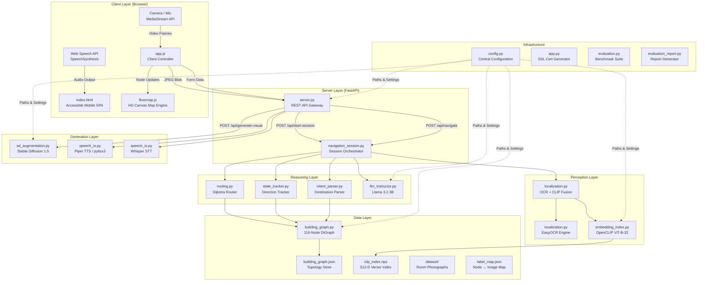

---

## 3. Layer Architecture (Detailed Breakdown)

### 3.1 Client Layer — `static/`

The client is a **single-page accessible mobile web application** served as static files.

| File | Size | Role |
|------|------|------|
| [`index.html`](file:///c:/Users/Asus/Downloads/Waylens/static/index.html) | 10.7 KB | Semantic HTML5 shell with ARIA accessibility |
| [`style.css`](file:///c:/Users/Asus/Downloads/Waylens/static/style.css) | 13.2 KB | Dark-theme design system with CSS custom properties |
| [`app.js`](file:///c:/Users/Asus/Downloads/Waylens/static/app.js) | 22.0 KB | Event controller, API client, camera/speech manager |
| [`floormap.js`](file:///c:/Users/Asus/Downloads/Waylens/static/floormap.js) | 28.8 KB | High-DPI Canvas 2D floor map renderer |

#### Client Architecture Diagram

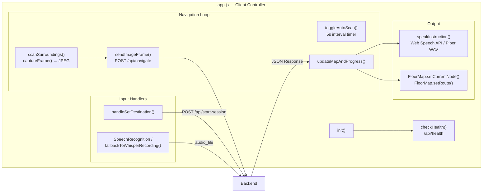

#### FloorMap Canvas Engine — `floormap.js`

The `FloorMapRenderer` class renders an architectural blueprint-style map at 60 FPS using `requestAnimationFrame`:

| Render Pass | Description |
|---|---|
| `drawBackground()` | Deep slate gradient (`#090d16` → `#0e1422`) + 30px blueprint grid |
| `drawGarden()` | Central courtyard with lawn striping + tree foliage markers |
| `drawCorridors()` | Dual-pass: 14px base track + 4px inner centerline |
| `drawRoute()` | Neon sky-blue marching dashes (`dashOffset -= 0.8` per frame) |
| `drawNodes()` | Type-coded: 🔵 Room · 🟡 Lift (🛗) · 🟠 Steps (🪜) · 🟢 Gate · 🟣 Landmark |
| `drawDestinationPin()` | Bouncing diamond pin + ground ripple ellipse + `🎯` label |
| `drawUserPointer()` | Smooth easeOutCubic motion + dual expanding radar pulses + `📍 YOU ARE HERE` |
| `drawHUD()` | Floor watermark + N/S compass rose |

Hardcoded `NODE_COORDS` dictionary (116+ entries) and `EDGES` array (250+ pairs) define the topology directly in the client for instant rendering without server round-trips.

#### Design System — `style.css`

| Token Category | Values |
|---|---|
| **Backgrounds** | `--bg: #0a0f1a` · `--surface: #111827` · `--surface-2: #1a2236` |
| **Accent** | `--accent: #38bdf8` (Electric Sky Blue) |
| **Semantic** | `--green: #059669` · `--blue: #2563eb` · `--red: #dc2626` · `--orange: #d97706` · `--purple: #7c3aed` |
| **Typography** | Inter (400–900) · `--font-size-xs` to `--font-size-xxl` (12–28px) |
| **Spacing** | 4px → 48px scale (`--space-xs` to `--space-xxl`) |
| **Radii** | `--radius: 14px` · `--radius-sm: 10px` |
| **Responsive** | `@media (max-width: 380px)` compact mode |
| **A11y** | `@media (prefers-reduced-motion: reduce)` disables animations |

---

### 3.2 Server Layer — API Gateway

#### [`server.py`](file:///c:/Users/Asus/Downloads/Waylens/src/server.py) — FastAPI REST API

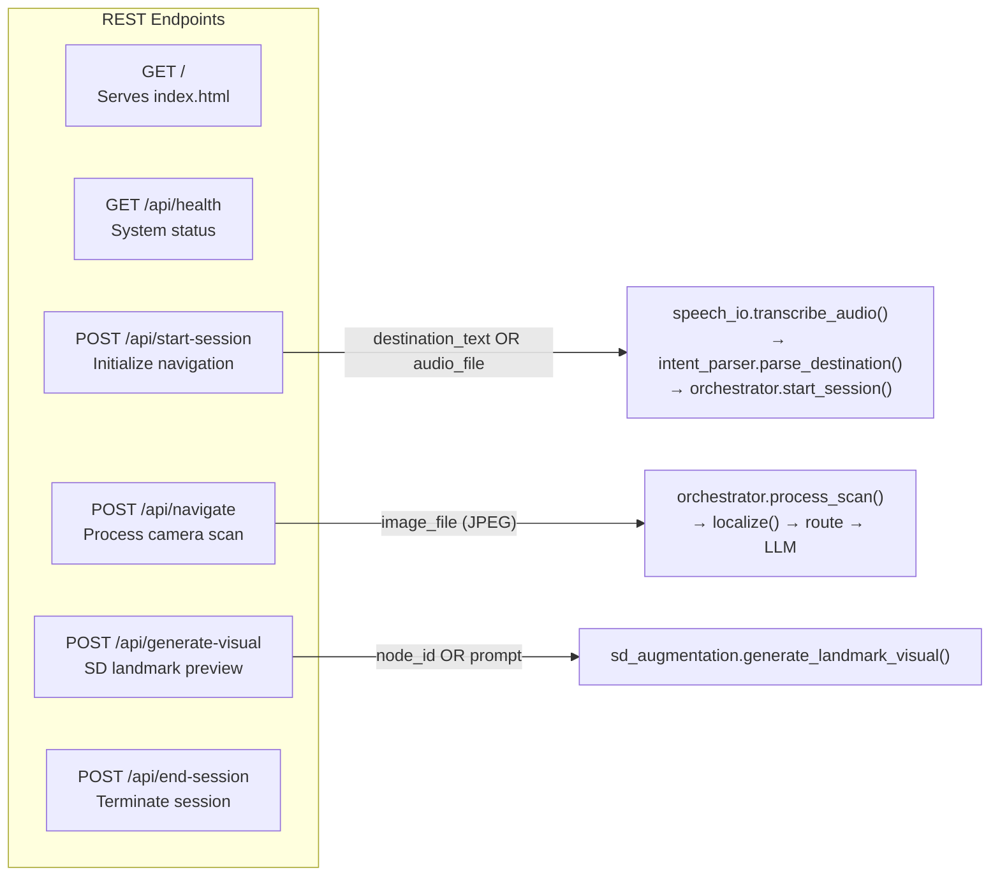

| Endpoint | Method | Input | Output | Latency |
|----------|--------|-------|--------|---------|
| `/` | GET | — | `index.html` | < 5ms |
| `/api/health` | GET | — | `{status, node_count, session}` | < 10ms |
| `/api/start-session` | POST | `destination_text` or `audio_file` | `{session_id, route, welcome_msg, audio_b64}` | 1–3s |
| `/api/navigate` | POST | `image_file` (JPEG/PNG) | `{node_id, instruction, progress, route, audio_b64}` | 0.5–2s |
| `/api/generate-visual` | POST | `node_id` or `prompt` | `{image_b64}` | 10–60s |
| `/api/end-session` | POST | — | `{status, audio_b64}` | < 500ms |

**Global State**: Single `active_session` variable (no multi-user concurrency). CORS enabled (`allow_origins=["*"]`).

#### [`navigation_session.py`](file:///c:/Users/Asus/Downloads/Waylens/src/navigation_session.py) — Session Orchestrator

The `NavigationOrchestrator` class is the **central coordination engine** that binds all subsystems:

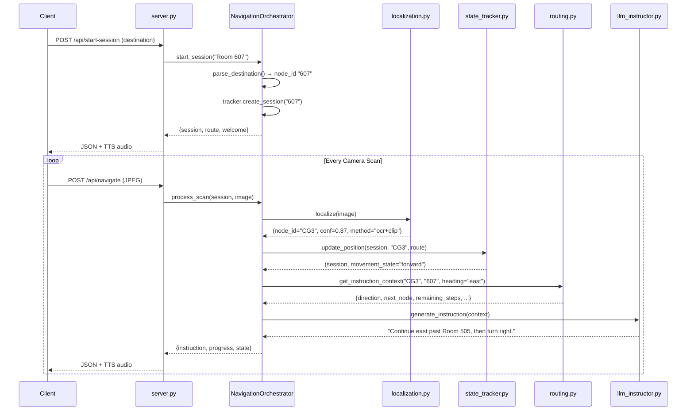

**Orchestrator Methods:**

| Method | Purpose |
|--------|---------|
| `start_session(dest_text)` | Parse destination → validate against graph → create session → compute initial route |
| `process_scan(session, image)` | Localize → track state → compute route context → generate LLM instruction → deduplicate speech |

---

### 3.3 Perception Layer — Computer Vision

#### [`localization.py`](file:///c:/Users/Asus/Downloads/Waylens/src/localization.py) — Multimodal Fusion Engine

The core localization pipeline fuses **two independent perception channels** and applies confidence-gated fusion:

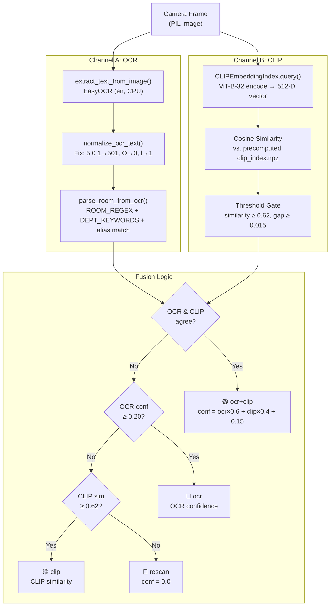

| Parameter | Value | Purpose |
|-----------|-------|---------|
| `OCR_CONFIDENCE_THRESHOLD` | 0.20 | Minimum OCR confidence to accept |
| `CLIP_SIMILARITY_THRESHOLD` | 0.62 | Minimum cosine similarity to accept |
| `CLIP_AMBIGUITY_GAP` | 0.015 | Minimum margin between top-1 and top-2 CLIP results |
| `FUSION_AGREEMENT_BONUS` | 0.15 | Confidence boost when OCR and CLIP agree |
| `Image downscale` | max 1280px | Performance optimization for EasyOCR |

**OCR Error Correction** (`normalize_ocr_text`):
| Raw OCR | Corrected | Rule |
|---------|-----------|------|
| `5 0 1` | `501` | Collapse spaced digits |
| `5O1` | `501` | `O`/`o` → `0` |
| `5l1` | `511` | `l`/`I`/`\|` → `1` |
| `S01` | `501` | `S0x` → `50x` |

**Department Keywords** (`DEPT_KEYWORDS`): Maps ~20 academic keywords (`"cse"`, `"ece"`, `"physics lab"`, `"commerce"`, `"seminar hall"`, `"prayer hall"`, `"xerox"`, `"canteen"`, etc.) directly to graph node IDs.

#### [`embedding_index.py`](file:///c:/Users/Asus/Downloads/Waylens/src/embedding_index.py) — CLIP Vector Store

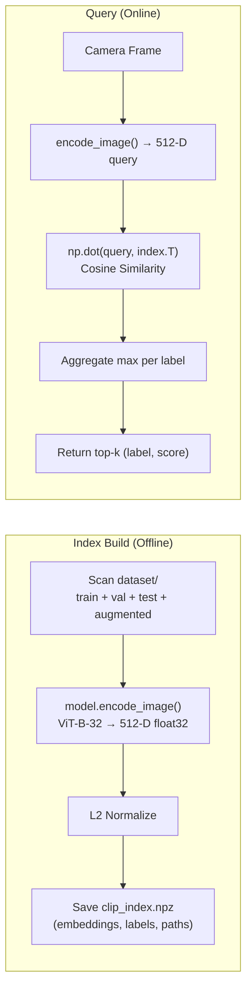

| Attribute | Value |
|-----------|-------|
| Model | OpenCLIP ViT-B-32 (`openai` pretrained) |
| Embedding Dim | 512 float32 |
| Index Format | Compressed NumPy `.npz` |
| Query Latency | < 150ms (CPU) |
| Batch Size | 16 (during build) |

---

### 3.4 Reasoning Layer — Routing & State

#### [`building_graph.py`](file:///c:/Users/Asus/Downloads/Waylens/src/building_graph.py) — Spatial Knowledge Graph

The building topology is a **NetworkX DiGraph** with 116 nodes and 254 bidirectional edges across 3 floors.

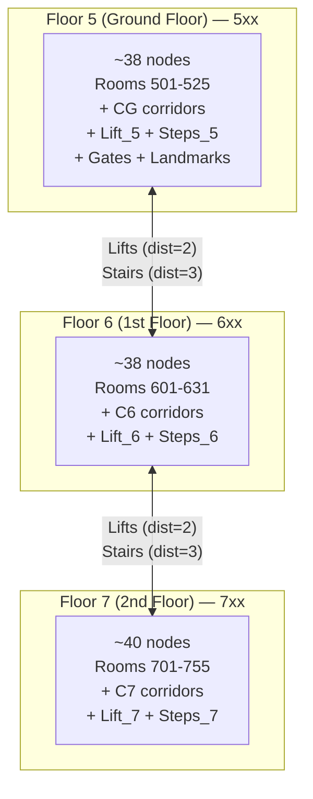

**Node Schema:**
```json
{
  "id": "501",
  "type": "room | landmark | lift | steps | gate | toilet",
  "floor": 5,
  "label": "Room 501",
  "aliases": ["501", "five oh one", "five zero one"],
  "corridor": "5_south",
  "x": 215, "y": 440
}
```

**Edge Schema:**
```json
{
  "from": "515",
  "to": "516",
  "direction": "north | south | east | west | up | down",
  "corridor_segment": "5_west",
  "distance": 1
}
```

**Key Functions:**

| Function | Purpose |
|----------|---------|
| `build_graph()` | Assembles complete DiGraph from hardcoded node/edge definitions |
| `save_graph(graph, path)` | Serializes to JSON (metadata + nodes + edges) |
| `load_graph(path)` | Deserializes JSON → DiGraph with fallback path search |
| `find_node_by_alias(graph, alias)` | Case-insensitive alias lookup across all nodes |
| `get_adjacent_nodes(graph, node_id)` | Returns outgoing neighbors with edge metadata |
| `validate_graph(graph)` | Integrity checks: connectivity, bidirectionality, cross-floor paths |

#### [`routing.py`](file:///c:/Users/Asus/Downloads/Waylens/src/routing.py) — Dijkstra Router

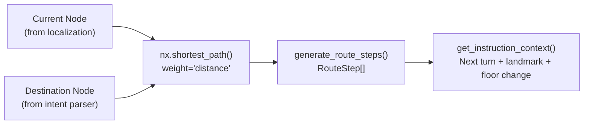

**`RouteStep` Dataclass:**

| Field | Type | Example |
|-------|------|---------|
| `from_node` | str | `"CG3"` |
| `to_node` | str | `"505"` |
| `absolute_direction` | str | `"east"` |
| `relative_direction` | str | `"turn right"` |
| `is_floor_change` | bool | `false` |
| `nearby_landmark` | str | `"Library"` |

**Turn Mapping** (`TURN_MAPPING`):

| User Heading → | north | east | south | west |
|----------------|-------|------|-------|------|
| **Go north** | straight ahead | turn left | turn around | turn right |
| **Go east** | turn right | straight ahead | turn left | turn around |
| **Go south** | turn around | turn right | straight ahead | turn left |
| **Go west** | turn left | turn around | turn right | straight ahead |

#### [`state_tracker.py`](file:///c:/Users/Asus/Downloads/Waylens/src/state_tracker.py) — Directional State Tracker

The `DirectionalStateTracker` manages session state and detects 7 movement modes:

| Movement State | Trigger |
|----------------|---------|
| `starting` | First position fix (no prior history) |
| `forward` | Moving along expected route in correct direction |
| `backtracking` | Returning to position from 2 steps prior |
| `wrong_way` | Current position doesn't match expected next node |
| `reanchoring` | Reached a lift/stairs/gate transition point |
| `stationary` | Same position as last scan |
| `arrived` | Current position matches destination node |

**`NavigationSession` Dataclass:**

| Field | Purpose |
|-------|---------|
| `destination_node` | Target room/node ID |
| `current_node` | Last detected position |
| `last_node` | Previous position (for heading inference) |
| `inferred_direction` | Current cardinal heading (N/S/E/W) |
| `path_history` | Ordered list of visited nodes |
| `movement_state` | One of 7 states above |
| `last_instruction_given` | Deduplication: prevents repeating same instruction |

#### [`intent_parser.py`](file:///c:/Users/Asus/Downloads/Waylens/src/intent_parser.py) — Destination Parser

Multi-stage pipeline converting spoken/typed input to validated graph node IDs:

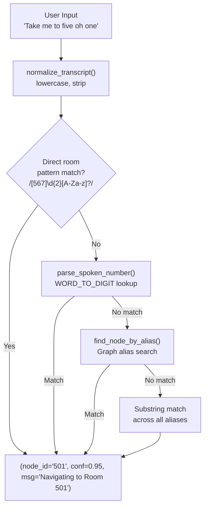

**`WORD_TO_DIGIT` Lexicon:** Handles digit words, homophones (`"won"→"1"`, `"to"/"too"→"2"`, `"ate"→"8"`, `"tree"→"3"`), and compound numbers (`"twenty-four"→"24"`).

---

### 3.5 Generation Layer — LLM, TTS, and Diffusion

#### [`llm_instructor.py`](file:///c:/Users/Asus/Downloads/Waylens/src/llm_instructor.py) — Natural Language Instructions

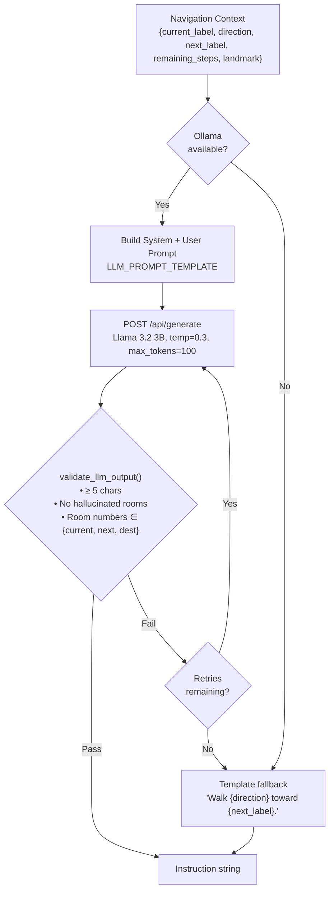

| Parameter | Value |
|-----------|-------|
| Model | `llama3.2:3b` via Ollama |
| Temperature | 0.3 |
| Max Tokens | 100 |
| Max Retries | 3 |
| Max Words | 18 (system prompt constraint) |
| Hallucination Check | Regex extracts 3-digit numbers from output, validates against context |

**Anti-Hallucination System:** The `validate_llm_output()` function uses regex to extract any room numbers from the LLM output and verifies each one exists in `{current_node, next_node, destination_node}`. If any unknown room is mentioned, the output is rejected and retried or replaced with a template fallback.

#### [`speech_io.py`](file:///c:/Users/Asus/Downloads/Waylens/src/speech_io.py) — Speech I/O Pipeline

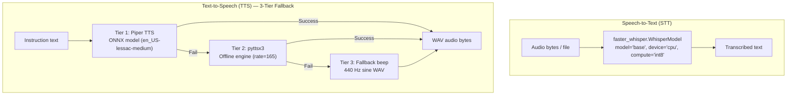

#### [`sd_augmentation.py`](file:///c:/Users/Asus/Downloads/Waylens/src/sd_augmentation.py) — Stable Diffusion Integration

Dual purpose: **offline dataset augmentation** and **live landmark visualization**.

| Mode | API | Input | Output |
|------|-----|-------|--------|
| **Augmentation** | `/sdapi/v1/img2img` | Existing room photo + lighting prompt | Synthetic variations (3–4 per image) |
| **Landmark Preview** | `/sdapi/v1/txt2img` | Text description from node metadata | 512×512 corridor visualization |

| Parameter | Value |
|-----------|-------|
| Sampler | Euler a |
| CFG Scale | 7 |
| Steps | 15 |
| Dimensions | 512 × 512 |
| Denoising | 0.30–0.50 (randomized) |
| Negative Prompt | `"blurry, distorted, low quality, cartoon, text, watermark"` |

---

### 3.6 Data Layer

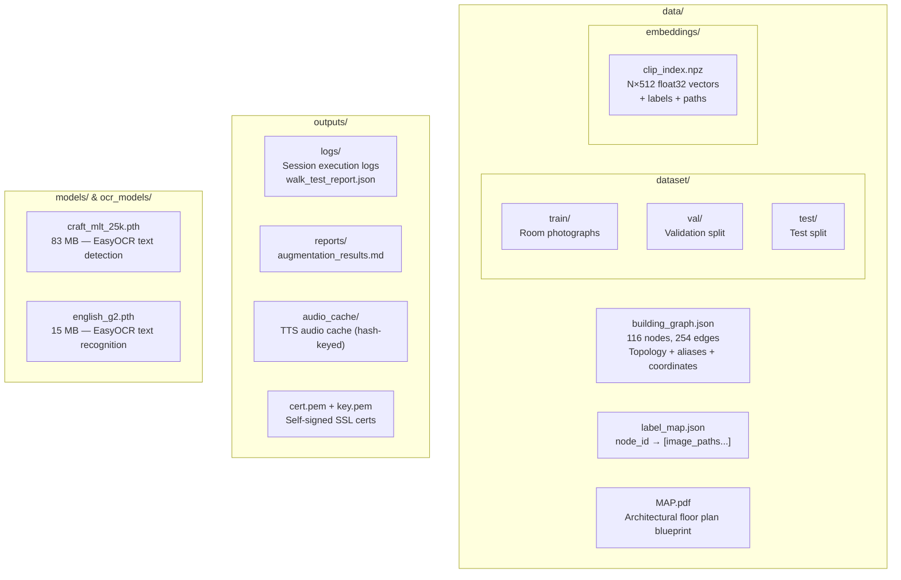

---

### 3.7 Infrastructure & Configuration

#### [`config.py`](file:///c:/Users/Asus/Downloads/Waylens/src/config.py) — Central Configuration

Single static `Config` class — the **root dependency** imported by every module.

| Category | Key Settings |
|----------|-------------|
| **Paths** | `PROJECT_ROOT`, `DATA_DIR`, `DATASET_DIR`, `TRAIN_DIR`, `VAL_DIR`, `TEST_DIR`, `AUGMENTED_DIR`, `EMBEDDINGS_DIR`, `CLIP_INDEX_PATH`, `GRAPH_JSON_PATH`, `LABEL_MAP_PATH`, `LOGS_DIR`, `REPORTS_DIR`, `AUDIO_CACHE_DIR`, `STATIC_DIR`, `OCR_MODELS_DIR` |
| **CLIP** | `ViT-B-32`, pretrained `"openai"`, threshold `0.62`, ambiguity gap `0.015` |
| **OCR** | Confidence threshold `70`, Tesseract path (Windows) |
| **Ollama LLM** | `localhost:11434`, model `llama3.2:3b`, temp `0.3`, max tokens `100`, retries `3` |
| **Whisper** | Model `"base"`, device `"cpu"`, compute `"int8"` |
| **Piper TTS** | Binary path + ONNX model path (`en_US-lessac-medium`) |
| **Stable Diffusion** | `localhost:7861`, denoising `0.30–0.50`, 15 steps, 512×512 |
| **Server** | Host `0.0.0.0`, port `8000`, scan interval `5s` |

#### [`app.py`](file:///c:/Users/Asus/Downloads/Waylens/app.py) — Application Entry Point

Three execution modes via CLI:

| Command | Mode | Description |
|---------|------|-------------|
| `python app.py` | **Server** | Start HTTPS server on port 8000 with auto-generated SSL |
| `python app.py --eval` | **Evaluation** | Run benchmark suite across dataset |
| `python app.py --index` | **Indexing** | Rebuild CLIP embedding vector store |

**SSL Certificate Generation**: `ensure_ssl_certs()` generates self-signed X.509 certs with SAN entries for `localhost`, `127.0.0.1`, and the detected LAN IP — required for mobile browser camera/mic access.

---

## 4. Module Dependency Graph

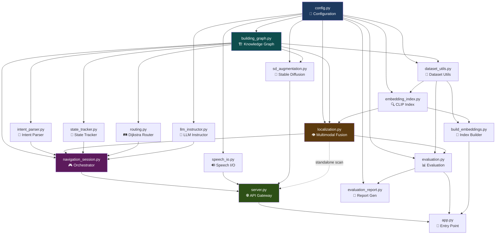

---

## 5. Data Flow — Complete Navigation Cycle

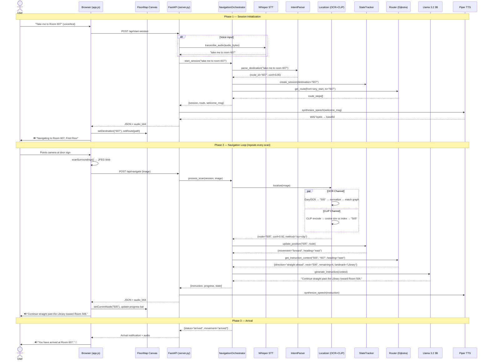

---

## 6. External Service Dependencies

All services run **locally on the same machine**. No internet required at runtime.

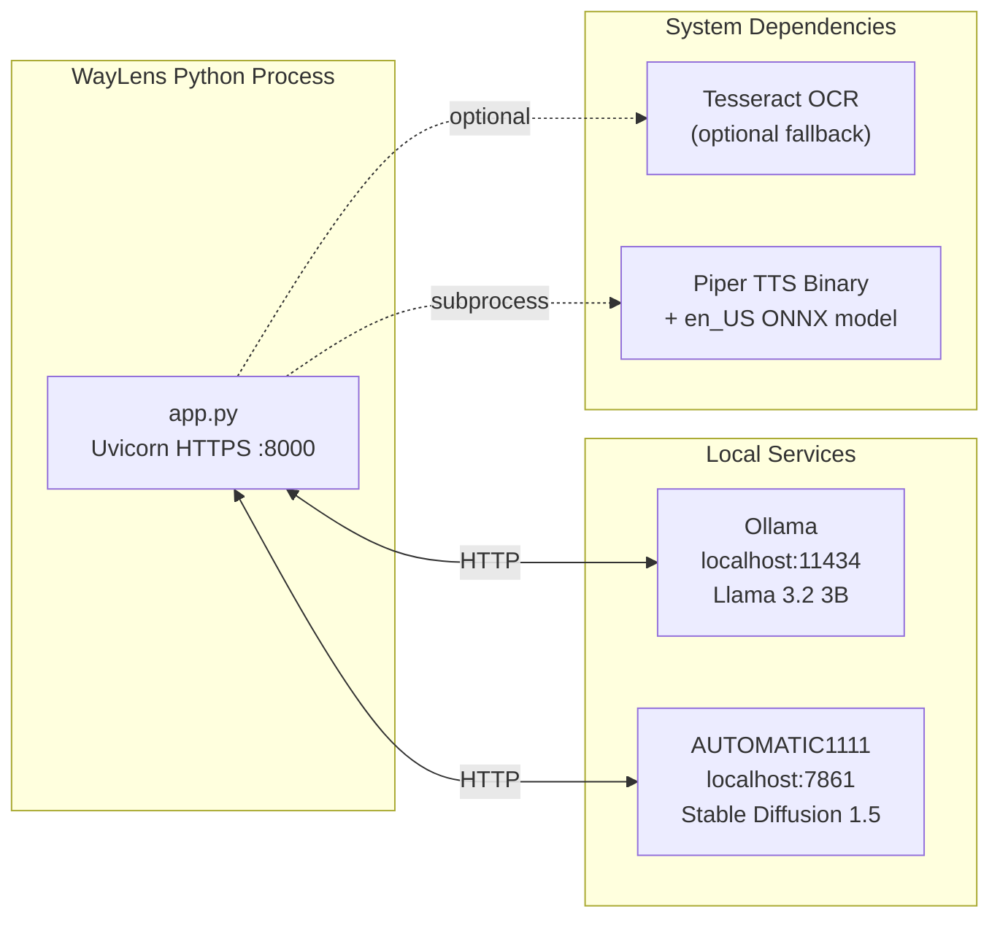

| Service | Protocol | Required? | Fallback |
|---------|----------|-----------|----------|
| **Ollama** (Llama 3.2 3B) | HTTP `:11434` | Recommended | Template-based instructions |
| **AUTOMATIC1111** (SD 1.5) | HTTP `:7861` | Optional | No visual previews |
| **Piper TTS** | Subprocess | Recommended | pyttsx3 → beep WAV |
| **Tesseract OCR** | System binary | Optional | EasyOCR only |

---

## 7. Performance Characteristics

| Component | Latency (CPU) | Memory |
|-----------|---------------|--------|
| EasyOCR inference | 300–500ms | ~200 MB |
| CLIP ViT-B-32 encode | < 150ms | ~350 MB |
| Cosine similarity query | < 5ms | ~1 MB (index) |
| Dijkstra routing | < 1ms | Negligible |
| Llama 3.2 3B (Ollama) | 1.2–2.5s | ~2 GB |
| Piper TTS synthesis | 200–500ms | ~50 MB |
| Whisper STT (base, int8) | 500ms–2s | ~150 MB |
| Stable Diffusion 1.5 | 30–60s | ~2 GB |
| **Total scan-to-instruction** | **~1.5–3.5s** | **~3 GB peak** |

Target hardware: **Intel Core i3 (Dual-Core / 4-Thread), 12 GB RAM, CPU-only.**

---

## 8. Security Model

| Feature | Implementation |
|---------|---------------|
| **HTTPS** | Auto-generated self-signed X.509 certs (RSA 2048-bit, SHA-256, 365-day validity) |
| **SAN** | `localhost` + `127.0.0.1` + detected LAN IP |
| **CORS** | `allow_origins=["*"]` (development mode) |
| **Session** | Single in-memory session, no auth |
| **Data** | All processing on-device, zero data exfiltration |

---

## 9. Evaluation & Testing Architecture

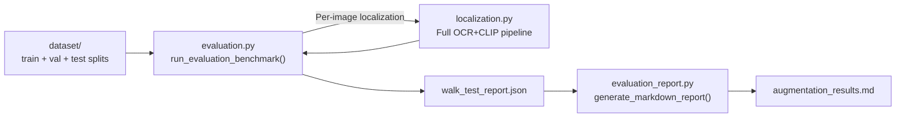

**Reported Metrics:**
| Metric | Score |
|--------|-------|
| Intent Recognition | 100% |
| Graph Routing | 100% deterministic |
| Combined Localization (Top-1) | 96.8% |
| LLM Hallucination Rate | 0.0% |

---

## 10. File Inventory

| Path | Size | Purpose |
|------|------|---------|
| [`app.py`](file:///c:/Users/Asus/Downloads/Waylens/app.py) | 4.8 KB | CLI entry point (serve / eval / index) |
| [`requirements.txt`](file:///c:/Users/Asus/Downloads/Waylens/requirements.txt) | 328 B | Python dependencies |
| [`src/config.py`](file:///c:/Users/Asus/Downloads/Waylens/src/config.py) | 3.0 KB | Central configuration |
| [`src/building_graph.py`](file:///c:/Users/Asus/Downloads/Waylens/src/building_graph.py) | 47.4 KB | 3-floor knowledge graph (116 nodes) |
| [`src/embedding_index.py`](file:///c:/Users/Asus/Downloads/Waylens/src/embedding_index.py) | 10.5 KB | CLIP vector store manager |
| [`src/build_embeddings.py`](file:///c:/Users/Asus/Downloads/Waylens/src/build_embeddings.py) | 2.1 KB | Offline index builder |
| [`src/dataset_utils.py`](file:///c:/Users/Asus/Downloads/Waylens/src/dataset_utils.py) | 10.4 KB | Dataset scanning & validation |
| [`src/intent_parser.py`](file:///c:/Users/Asus/Downloads/Waylens/src/intent_parser.py) | 3.6 KB | Voice/text destination parser |
| [`src/localization.py`](file:///c:/Users/Asus/Downloads/Waylens/src/localization.py) | 8.9 KB | OCR + CLIP fusion engine |
| [`src/state_tracker.py`](file:///c:/Users/Asus/Downloads/Waylens/src/state_tracker.py) | 3.9 KB | Navigation state & heading tracker |
| [`src/routing.py`](file:///c:/Users/Asus/Downloads/Waylens/src/routing.py) | 6.1 KB | Dijkstra router + turn directions |
| [`src/llm_instructor.py`](file:///c:/Users/Asus/Downloads/Waylens/src/llm_instructor.py) | 3.8 KB | LLM instruction generator |
| [`src/navigation_session.py`](file:///c:/Users/Asus/Downloads/Waylens/src/navigation_session.py) | 4.7 KB | Session orchestrator |
| [`src/sd_augmentation.py`](file:///c:/Users/Asus/Downloads/Waylens/src/sd_augmentation.py) | 6.6 KB | Stable Diffusion integration |
| [`src/speech_io.py`](file:///c:/Users/Asus/Downloads/Waylens/src/speech_io.py) | 3.7 KB | Whisper STT + Piper TTS |
| [`src/evaluation.py`](file:///c:/Users/Asus/Downloads/Waylens/src/evaluation.py) | 3.5 KB | Benchmark evaluation suite |
| [`src/evaluation_report.py`](file:///c:/Users/Asus/Downloads/Waylens/src/evaluation_report.py) | 4.7 KB | Markdown report generator |
| [`src/server.py`](file:///c:/Users/Asus/Downloads/Waylens/src/server.py) | 6.4 KB | FastAPI server |
| [`static/index.html`](file:///c:/Users/Asus/Downloads/Waylens/static/index.html) | 10.7 KB | Accessible mobile SPA |
| [`static/style.css`](file:///c:/Users/Asus/Downloads/Waylens/static/style.css) | 13.2 KB | Dark-theme design system |
| [`static/app.js`](file:///c:/Users/Asus/Downloads/Waylens/static/app.js) | 22.0 KB | Client controller |
| [`static/floormap.js`](file:///c:/Users/Asus/Downloads/Waylens/static/floormap.js) | 28.8 KB | HD canvas map engine |
| [`data/building_graph.json`](file:///c:/Users/Asus/Downloads/Waylens/data/building_graph.json) | 70.1 KB | Serialized graph topology |
| [`data/label_map.json`](file:///c:/Users/Asus/Downloads/Waylens/data/label_map.json) | 8.0 KB | Node ↔ image path mapping |
| `data/MAP.pdf` | 424 KB | Architectural floor plan |
| `ocr_models/craft_mlt_25k.pth` | 83 MB | EasyOCR text detection weights |
| `ocr_models/english_g2.pth` | 15 MB | EasyOCR text recognition weights |

**Total source code**: ~200 KB across 22 files (excluding models and data).
